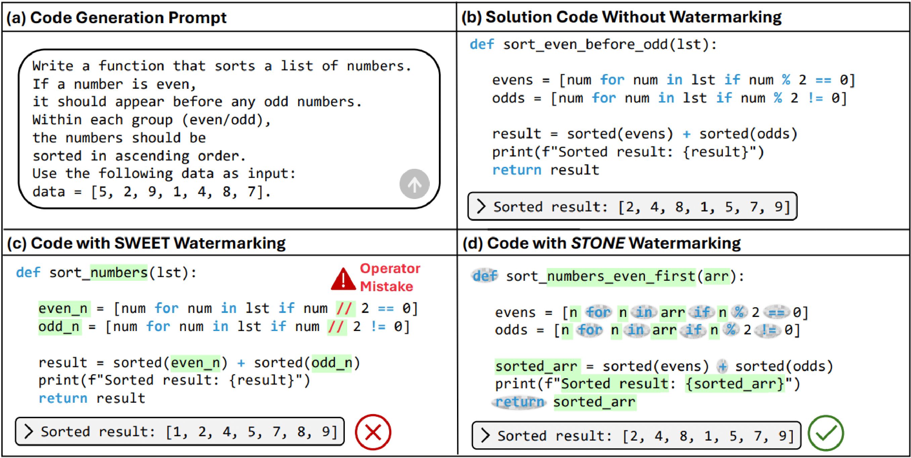

# Marking Code Without Breaking It: Code Watermarking for Detecting LLM-Generated Code
<!-- [**📖 Paper**](https://arxiv.org/) -->

## TL; DR
We propose STONE, a syntax-aware watermarking method that embeds watermarks only in non-syntax tokens to reliably detect AI-generated code without breaking functionality, and introduces CWEM, a comprehensive metric for evaluating code watermark effectiveness.

## About STONE 
**STONE (Syntax TOkeN preserving codE watermarking)** is a robust, syntax-aware watermarking approach designed specifically for code generated by large language models. It strategically embeds watermarks only in non-syntax tokens, preserving critical elements such as keywords, operators, and delimiters, to ensure that the functionality and structural integrity of the code remain intact. By modifying only tokens with minimal impact on code execution, STONE provides a reliable and efficient solution to trace the origin of generated code while maintaining optimal performance.



## About CWEM
**CWEM (Code Watermarking Evaluation Metric)** is a comprehensive framework that objectively assesses watermarking techniques across three key dimensions: correctness, detectability, and imperceptibility. It quantifies functional correctness using pass@k metrics, evaluates watermark detectability through statistical measures such as z-scores and AUROC, and ensures that the presence of a watermark does not compromise the natural token distribution of code by measuring perplexity. This balanced metric enables clear comparisons among different methods and guides the optimization of watermarking strategies to enhance transparency and accountability in code generated by large language models.

The overall performance of a watermarking technique is evaluated using CWEM, which integrates functional correctness, detectability, and imperceptibility into a single metric:

$$CWEM = \alpha \cdot \mathrm{Correctness}(C_{wm}) + \beta \cdot \mathrm{Detectability}(C_{wm}) + \gamma \cdot \mathrm{Naturalness}(C_{wm},C)$$

with the condition that $\alpha + \beta + \gamma = 1$. 

The individual components are defined as follows:

### 1. Correctness

$$\mathrm{Correctness}(C_{wm}) = \mathbb{E}_{C_{wm}}\left[ 1 - \frac{\binom{n - c}{k}}{\binom{n}{k}} \right]$$

Correctness evaluates whether the code works correctly before and after watermark insertion.
- $n$: Total number of code samples generated for a given problem
- $c$ : Number of code samples that work correctly
- $\binom{n}{k}$ : Number of ways to choose $k$ samples from $n$ samples
- $\binom{n - c}{k}$ : Number of ways to choose $k$ samples consisting only of incorrect code (i.e., excluding the correct ones)
- Therefore, $1 - \frac{\binom{n - c}{k}}{\binom{n}{k}}$ represents the probability that at least one correct code sample is included when $k$ samples are selected, and the overall correctness score is evaluated as the expectation of this probability over the watermark code set $C_{wm}$.

### 2. Detectability
Detectability evaluates how clearly the watermark is embedded in the code using statistical metrics such as the z-score and AUROC.

#### 2-1. z-score: Green Token Ratio
$$z(C_{wm}) = \frac{|C_{wm}|_G - \gamma T}{\sqrt{T \gamma (1 - \gamma)}}$$

- $∣C_{wm}∣_G$ : The number of green list tokens in the watermarked code
- $T$ : Total number of tokens in the code
- $\gamma$: Expected proportion of green tokens in non-watermarked code
- The denominator represents the standard deviation under a binomial distribution. 
- The z-score indicates how many standard deviations the actual count of green tokens deviates from the expected count; a larger value means the watermark is more clearly present.

#### 2-2. Detecting LLM-Generated Code Using the Green Token Ratio
To determine whether the generated code has a watermark, various threshold values $\tau$ are applied to compute the True Positive Rate (TPR) and False Positive Rate (FPR).
- True Positive Rate (TPR): For watermarked code $C_{wm}$, TPR is the proportion of code samples with a z-score exceeding the threshold $\tau$.

$$\text{TPR}(\tau) = \frac{\sum_{j} \mathbf{1}(z(C_{wm}^{(j)}) > \tau)}{|{C_{wm}}|}$$

- False Positive Rate (FPR): For non-watermarked code $C_{H}$, FPR is the proportion of code samples with a z-score exceeding the threshold $\tau$:

$$\text{FPR}(\tau) = \frac{\sum_{i} \mathbf{1}(z(C_H^{(i)}) > \tau)}{|{C_H}|}$$

#### 2-3. Overall Detectability Using AUROC
$$\mathrm{Detectability}(C_{wm}, C_H) = \int_{-\infty}^{\infty} \text{TPR}(\tau) \frac{d\text{FPR}(\tau)}{d\tau} d\tau$$

- The Detectability score is obtained by integrating the relationship between TPR and FPR over all threshold values $\tau$, which calculates the AUROC.
- An AUROC value close to 1 indicates that the watermark is clearly distinguishable, whereas a value near 0.5 indicates that watermarked and non-watermarked code are difficult to distinguish.
- A high AUROC value demonstrates that the distribution differences of the z-scores based on the green token ratio effectively separate watermarked code from non-watermarked code.

### 3. Imperceptibility
Imperceptibility assesses whether the code remains fluent (in terms of Perplexity) after watermark insertion, ensuring that it appears natural to human readers.

The difference in Perplexity between non-watermarked code $C_{H}$ and watermarked code $C_{wm}$ is normalized to measure imperceptibility.

$$PPL(C_{wm}) = \frac{1}{|C_{wm}|} \sum_{j=1}^{|C_{wm}|} \exp \left( -\frac{1}{N_j} \sum_{i=1}^{N_j} \log P(w_i^{(j)} | w_{<i}^{(j)}) \right)$$

- $N_j$: Number of tokens in the j-th code sample in $C_{wm}$.
- $P(w_i^{(j)} | w_{<i}^{(j)})$: The probability of token w_i^(j) given its preceding context in the j-th sample

Then, the Imperceptibility score is defined as:

$$\mathrm{Naturalness}(C_{wm}, C) = 1 - \frac{|\text{PPL}(C_{wm}) - \text{PPL}(C)|}{\text{PPL}(C)}$$

- The Imperceptibility score normalizes the absolute difference in Perplexity between watermarked and non-watermarked code by the Perplexity of the original code C.
- A score closer to 1 indicates that the watermark has little effect on the natural flow of the code, meaning the watermark is well concealed.

## Getting Started

### Project Structure
```
STONE-watermarking/
├── stone.yaml                  # Conda environment configuration file
├── .env                        # API key file (to be created by the user)
├── stone_implementation/       # Main implementation directory
│   ├── run.sh                  # Script to generate watermarked code
│   ├── custom_evalplus/        # Custom evaluation scripts
│   │   └── evalplus/
│   │       └── pass_evaluation.sh  # Script to evaluate HumanEvalplus and MBPPplus
│   └──  evaluation/             # Evaluation scripts and notebooks
│       ├── AUROC_perplexity.ipynb # Notebook to calculate detectability and imperceptibility scores
│       └── cwem.py             # Script to calculate CWEM score
└── README.md                   # Project documentation
```


### Installation

Environment settings:
```bash
git clone "[OUR REPO]"
conda env create -f stone.yaml
```
API key settings:
```bash
#make .env file and put your api key
HF_ACCESS_TOKEN="[INSERT YOUR API KEY]"
```

### Training
1-1. Train HumanEval+, MBPP+, and HumanEvalPack
Generating watermarked machined-generated code:
```bash
cd stone_implementation
bash run.sh
```

1-2. Train CodeIP
Generating watermarked machined-generated code:
```bash
cd CodeIP/examples/codeip_humaneval/src/watermarking/utils
python generate_lstm_dataset.py
python train_type_predictor.py

cd CodeIP/examples/codeip_humaneval/src/
python run_wm.py --language python --save_path ./output/result_python.json
```

### Evaluating

#### 1. Calculating correctness score

1-1. For other baseline and STONE

1-1-1. Evaluate HumanEval+ and MBPP+
```bash
cd stone_implementation/custom_evalplus/evalplus
bash pass_evaluation.sh
```
1-1-2. Evaluate HumanEvalPack
```bash
tar -cvf bigcode-evaluation-harness.tar.gz bigcode-evaluation-harness
tar -cvf results.tar.gz ./stone_implementation/results
```
Upload bigcode-evaluation-harness.tar.gz and results.tar.gz to Google Drive and run the notebook file below to calculate the correctness score.

https://drive.google.com/file/d/1IymQy7fJyKFYSgZokuWVfW1yThNJxQ53/view?usp=sharing

1-2. For CodeIP
```bash
cd CodeIP/examples/codeip_humaneval/src/output
python convert.py
bash pass_evaluation.sh
```
#### 2. Getting detectability and imperceptibility scores

2-1. For other baseline and STONE
```bash
cd stone_implementation/evaluation
AUROC_perplexity.ipynb
```
2-2. For CodeIP
```bash
#1) Getting detectability score
cd CodeIP/examples/codeip_humaneval/src/output
# Check the "acc" value in the "codeip_results.json" file and calculate the success rate.
Success Rate = (Count the number of "TRUE" values) / (Count the length of the "acc" list)

#2) Getting imperceptibility score
cd CodeIP/examples/codeip_humaneval/src/output
python perplexity.py
```

#### 3. Calculating CWEM (Code Watermarking Evaluation Metric)
Combine the obtained correctness, detectability, and imperceptibility scores to calculate the CWEM score.
```bash
cd stone_implementation/evaluation
cwem.py
```

## Acknowledgements
This repository is based on the codes of [MarkLLM](https://github.com/THU-BPM/MarkLLM), [CodeIP](https://github.com/CGCL-codes/naturalcc/tree/main/examples/codeip) and [bigcode-evaluation-harness](https://github.com/bigcode-project/bigcode-evaluation-harness)